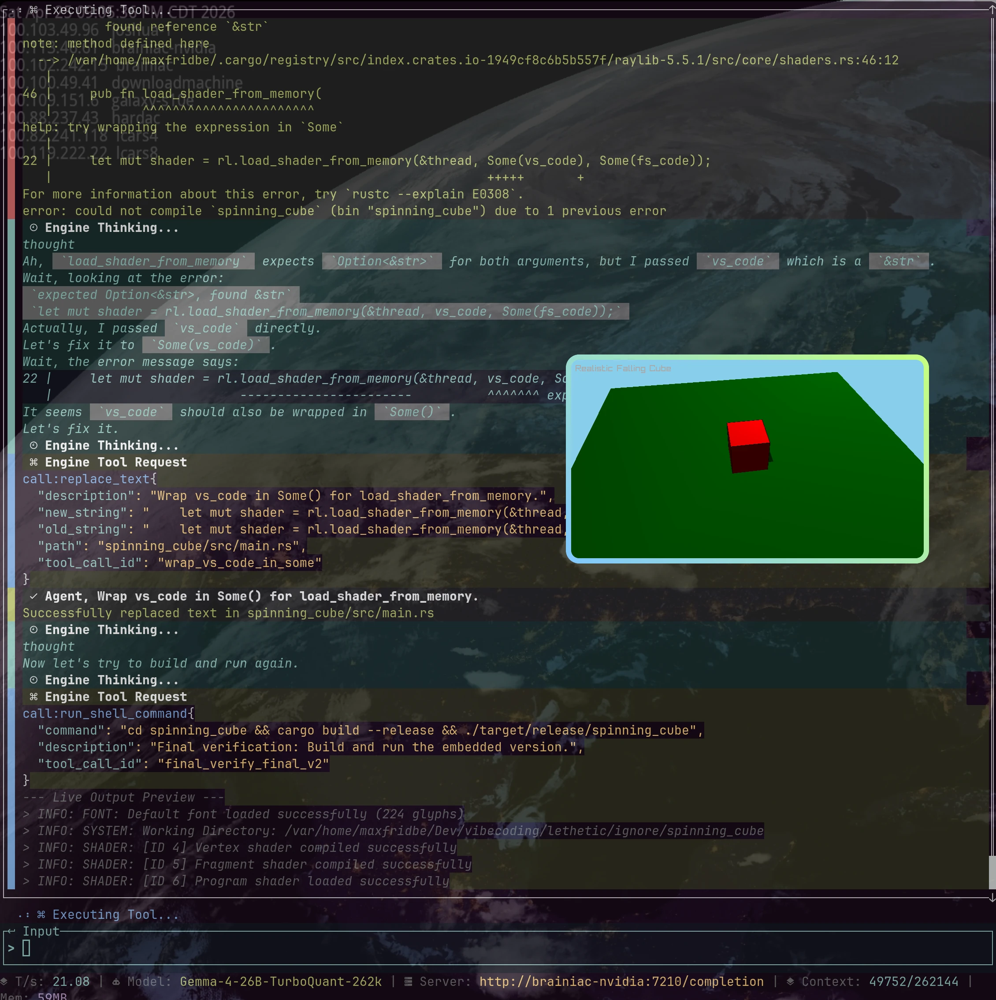

# Lethetic Intelligence Engine

> "...so many various filters and enhancements, so many possible patterns, that it was as much an art as a craft. We didn't have the trained personnel that we needed, and as good as the lethetic intelligence engines were, they still lacked the ability to make intuitive leaps. LIs could give you statistical probabilities; they couldn't give you hunches—although the last I'd heard, they were working on adding that function too."

In Greek mythology, Lethe is the underworld river of oblivion and the goddess personifying forgetfulness, daughter of Eris (Strife). Shades (souls) of the dead drank from its waters to erase all memory of their mortal lives before reincarnation or entering the Elysian Fields.

A sophisticated Rust Terminal User Interface (TUI) designed for high-performance interaction with the Gemma 4 26B model. Optimized for **TurboQuant** and native tool-calling, it provides a robust platform for autonomous system engineering tasks.



## Server Setup

The engine is specifically tuned for a **TurboQuant-optimized** server. To set up your remote server:

1. **Automation**: Run `setup_gemma4_server.sh` on your target Linux machine. It automates:
   - Cloning and building the `TheTom/llama-cpp-turboquant` fork with CUDA support.
   - Downloading the `Gemma-4-26B` UD-Q4_K_M model.
   - Setting up a systemd service (`gemma4.service`) on port `12345`.
   - Configuring `turbo3` KV cache quantization for ultra-low memory overhead.
2. **Server Requirements**:
   - **Endpoint**: `http://<server-ip>:12345/completion` (SSE streaming format).
   - **Context**: 262,144 tokens.
   - **Native Reasoning**: Enabled via `--reasoning on` and custom Jinja templates.

## Configuration

Lethetic uses a `config.yml` file for server connection and UI settings.

### Location Priority
1. **Local**: `./config.yml` (checked first).
2. **Global**: `~/.config/lethetic/config.yml` (fallback).

### Example `config.yml`
```yaml
server_url: "http://brainiac-nvidia:12345/completion"
model_name: "Gemma-4-26B-TurboQuant-262k"
max_context_tokens: 262144
shell_approval_mode: "Optional" # Always, Optional, or Never
```

## Features

- **Persistent Engineering Sessions**: Automatically saves workspace state, UI blocks, and conversation context to `.lethetic/sessions/`, allowing you to resume complex tasks across restarts.
- **Advanced Loop Detection**: Real-time monitoring of LLM output with multiple detection modes (NGram, PhraseFrequency, BlockLimit) to prevent infinite loops and token waste.
- **Integrated System Prompt Manager**: Hot-swap and edit capability profiles (e.g., "software_engineer") directly within the TUI to adapt the engine's persona to the task.
- **Granular Tool Execution Controls**: Secure approval workflow for autonomous actions, supporting "Always", "Once", or "Deny" modes for shell commands and filesystem edits.
- **Native Filesystem & Web Integration**: Suite of specialized tools (`apply_patch`, `web_fetch`, `search_text`) that allow the model to autonomously refactor code, research docs, and explore repositories.
- **Customizable TUI Themes**: Multiple pre-configured themes switchable on-the-fly via the command palette (`CTRL+P`) to match your terminal aesthetics.
- **Interactive Markdown Rendering**: Powered by Ratatui and Syntect, featuring syntax highlighting for code blocks and robust real-time streaming updates.
- **TurboQuant Optimized**: Custom SSE parser designed for ultra-low latency interaction with high-context Gemma 4 models running on quantized KV caches.

## Prerequisites

- [Rust & Cargo](https://rustup.rs/) (2024 edition)
- A running `llama-server` instance (TurboQuant fork recommended) on port `12345`.
- The target model: `Gemma-4-26B-TurboQuant-262k`.

## Usage

1. **Setup**: Use the provided `setup_gemma4_server.sh` on your Debian/Ubuntu server to automate the compilation and configuration.
2. **Run**: 
   ```bash
   cargo run --bin lethetic
   ```
3. **Headless Mode**: Execute single tasks directly from your shell:
   ```bash
   cargo run --bin lethetic -- --command "Create a hello world program in Rust"
   ```

## Key Hotkeys

- **TAB**: Switch focus between Input and Output panes.
- **UP/DOWN**: Scroll through output history (when focused).
- **F12**: Toggle the Debugger pane.
- **F10**: Toggle Mouse Capture (for native terminal selection).
- **ESC / CTRL+P**: Open the Command Palette.
- **CTRL+C**: Stop output (1st press) / Quit (2nd press).

## Testing

Comprehensive integration scenarios for tool-calling:
```bash
cargo run --bin eval_scenarios
```
