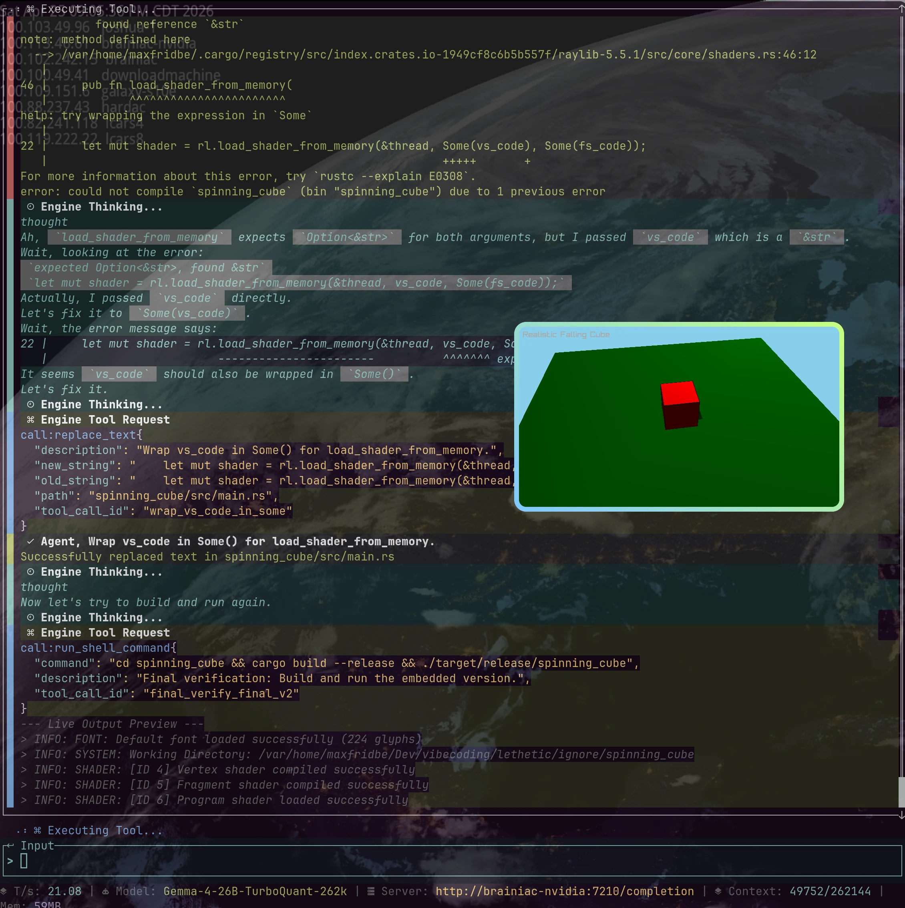

# Lethetic Intelligence Engine

> "...so many various filters and enhancements, so many possible patterns, that it was as much an art as a craft. We didn't have the trained personnel that we needed, and as good as the lethetic intelligence engines were, they still lacked the ability to make intuitive leaps. LIs could give you statistical probabilities; they couldn't give you hunches—although the last I'd heard, they were working on adding that function too."

A Rust TUI coding agent for local and proxied LLMs, with an optional exact-identity HTTPS browser mirror and default controller-token authentication. It supports OpenAI-compatible servers and native Anthropic Messages through `claude-code-proxy`, stable multi-connection model switching, native tools, and an optional persistent Python-only runspace.



---

## Quick Start

```bash
# Build
cargo build --release

# Run (reads config from ./config.yml or ~/.config/lethetic/config.yml)
cargo run --bin lethetic

# Headless / scripted
cargo run --bin lethetic -- --command "Fix all TypeScript errors in src/"

# Browser control (bare --rc asks how to bind) and a sandboxed Python-only agent
lethetic --rc
lethetic --python-only isolated
```

The debugger pane starts hidden (F12 shows it, F9 shows the model's todo list). Ctrl+P opens the command palette; type to fuzzy-filter it. Each directory remembers the model you last selected, and resuming a session restores its model, prompt, Agent Mode, theme and loop-detection mode.

### Optional browser controller

Expose the same chat to a browser with `--rc`:

```bash
lethetic --rc                     # interactive: pick address, port, auth, files, surface
lethetic --rc 127.0.0.1           # this machine only, default port 11223, private token URL
lethetic --rc brainiac:9443       # a lowercase host name or IP owned by this machine
lethetic --rc 10.0.0.5 --rc-open  # no token: everyone who can reach the address gets control
lethetic --rc brainiac --rc-files # also share the launch directory read-only (Linux)
lethetic --rc brainiac --rc-only  # browser only, never enters the terminal UI
```

You can also start it later from **Ctrl+P → Remote Control: start**, which asks the same questions in a dialog and keeps the running session. Bare `--rc` lists this machine's loopback, interface, and host-name identities and asks how to bind; it prints the equivalent flags before starting. Every form uses exact-identity HTTPS with a generated certificate whose sole SAN is the chosen IP or DNS name, and by default a fresh process token protects the browser controller. Verify the printed fingerprint and keep the capability URL private. The first Enter acknowledges the displayed controller information and activates the browser-side actor while the terminal remains ordinary; press Enter later to enter the TUI of the same running actor.

`--rc-only` requires `--rc`, conflicts with `--command`, and runs as a browser-only foreground process rather than daemonizing. Once started it ignores Unix SIGHUP and keeps running with zero browser clients. `--rc-open` keeps HTTPS but **does not authenticate the controller**: Lethetic prints a pre-bind warning and requires an Enter acknowledgement; restrict every printed address with host firewall and VPN ACLs. `--rc-files` shares only the fixed launch directory and its descendants read-only; protected control/credential files, links, mounts and special files are excluded, and in `--rc-open` mode every reachable peer can view them. Bring your own TLS with `--rc-tls-cert`/`--rc-tls-key` plus `--rc-token-file` or `--rc-open`.

The long spellings still work: `--wfe-remote-control <HTTPS_URL>`, `--wfe-files localonly`, `--wfe-disable-authtoken`, `--service`, `--wfe-tls-cert`, `--wfe-tls-key`, `--wfe-auth-token-file`. See [`docs/web-remote-control.md`](docs/web-remote-control.md) for the complete flag matrix, threat model, protocol, build, and recovery details.

The protocol-v6 browser UI uses canonical `H`/`T`/`C`/`D` palette accelerators from its noneditable command list, a persistent wide right-hand Debugger or focus-trapped narrow drawer, bounded browser-safe operational diagnostics, and complete application/transport status in two horizontally scrollable bottom rows. Podman status includes only validated retained or active-transient operational names—never raw container/image IDs. Exact loss metadata explains filtering, redaction, fixed-size truncation, and invalid-source replacement without inferring loss from displayed text.

---

## Server Setup

Lethetic is tuned for a **TurboQuant llama.cpp** server. Two models are supported simultaneously via GPU hot-swap (each sleeps when idle, wakes on request).

### Gemma 4 26B — port 7210

```bash
bash setup_gemma4_server.sh
```

Automates: build TurboQuant llama.cpp fork with CUDA, download `gemma-4-26B-A4B-it-UD-Q5_K_S.gguf`, install chat template, create `gemma4.service`.

Key parameters:
- `--cache-type-k turbo3 --cache-type-v turbo3` — TurboQuant KV quantization
- `--ctx-size 262144` — 256k context
- `--reasoning on --jinja` — chain-of-thought + custom tool-call template
- `--temp 0.2 --repeat-penalty 1.09`

### Qwen3 27B MTP — port 7211

```bash
bash setup_qwen3_server.sh
```

Downloads `Qwen3.6-27B-Q5_K_M.gguf` and creates `qwen3.service`.

Key parameters:
- `--cache-type-k turbo3 --cache-type-v turbo3` — required for full 262k context with TurboQuant KV quantization
- `--ctx-size 262144` — 262k context
- `--reasoning on --jinja`
- `--temp 0.2 --repeat-penalty 1.05`

### GPU memory notes

Both models use `--sleep-idle-seconds 30s`. When idle, each releases GPU VRAM. With two RTX cards (≈24GB total), only one model is resident at a time. Switching models causes a ~5–10s reload pause on first request.

---

## Configuration

### Location priority

Lethetic selects its primary model configuration from:

1. `./config.yml` (checked first)
2. `~/.config/lethetic/config.yml`

A sibling `config.local.yml` overlays the selected file for machine-specific endpoints or keys (entries merge by `name`). Lethetic also keeps two small state files it writes itself, so the hand-edited config is never rewritten:

- `.lethetic/last_model.json` in each working directory: the model last selected there, re-activated at startup.
- `~/.config/lethetic/saved_models.yml`: models added from the model picker's catalog scan, plus their catalog list prices, merged into each connection's `models` list at startup.

Python-mode settings use separate managed sidecars so the TUI never rewrites model configuration or secrets:

1. `~/.config/lethetic/python-mode.yml`
2. `<workspace>/.lethetic/python-mode.yml` (overrides global)
3. A one-time in-memory selection (current chat only)
4. A literal Python CLI flag (immutable for this process; overrides all above)

### Example `config.yml`

```yaml
server_url: http://brainiac-nvidia:7210/v1/responses
model: Gemma-4-26B-TurboQuant-262k
context_size: 262144
theme: Default

model_servers:
  - id: local-gemma
    name: Gemma 4 26B
    kind: open_ai_chat_completions
    url: http://brainiac-nvidia:7210/v1/responses
    model: Gemma-4-26B-TurboQuant-262k
    parser: gemma4

  - id: local-qwen
    name: Qwen3 27B
    kind: open_ai_chat_completions
    url: http://brainiac-nvidia:7211/v1/responses
    model: Qwen3-27B-Q5
    parser: qwen3

  - id: local-claude-code-proxy
    name: Claude Code Proxy (Local)
    kind: claude_code_proxy
    url: http://127.0.0.1:18765
    model: gpt-5.6-sol
    parser: default
    api_key: claudecodex-local # non-secret placeholder
    context_size: 262144 # legacy fallback for unlisted discovered models
    context_limits:
      applies_to_models: [gpt-5.6-sol]
      total_context_tokens: 1050000
      maximum_input_tokens: 922000
      maximum_output_tokens: 128000
      request_output_tokens: 24576
      lethetic_input_budget_tokens: 900000
    thinking: true
    extra_body:
      output_config:
        effort: max
```

`context_size` remains the backward-compatible input/history budget for models without exact metadata. `context_limits` applies only to an exact listed model ID; discovered models that are not listed use the legacy fallback instead of inheriting Sol's limits. Lethetic re-trims the active conversation immediately when switching to a smaller input budget.

`extra_body` may contain provider extension fields such as `output_config`, but it must be an object and cannot override host-owned request fields: `model`, `messages`, `system`, `max_tokens`, `max_completion_tokens`, `stream`, `stream_options`, `tools`, `tool_choice`, `parallel_tool_calls`, `functions`, `function_call`, `mcp_servers`, `n`, or `thinking`. Lethetic rejects these keys in both the active config and every model-server entry before provider I/O.

### `parser` dialect

Each `model_servers` entry has a `parser` field that controls two things:

| `parser` | Initial state | Tool call format |
|---|---|---|
| `gemma4` (default) | Thought block | `<\|"\|>string<\|"\|>` asymmetric markers |
| `qwen3` / `default` | Text | Standard JSON strings |

The system prompt's **Tool call format** section is automatically tailored to the active model — Qwen3 receives plain JSON instructions; Gemma4 receives the asymmetric marker instructions. Switching models via the palette reloads the parser and context.

### Connection kinds

`kind` is independent from the model/parser and defaults to `open_ai_chat_completions` for old configuration files.

| `kind` | Protocol | Tool behavior |
|---|---|---|
| `open_ai_chat_completions` | OpenAI Chat Completions through `gemma-chat` | Existing structured or marker-based calls |
| `claude_code_proxy` | Native Anthropic Messages at `/v1/messages` | Native `tool_use`/`tool_result`, signed thinking replay |

Stable `id` values distinguish connections even when they share a URL. Legacy entries fall back to `name`.

### Attaching to `claude-code-proxy`

Lethetic connects to an already-running proxy; it never starts, stops, authorizes, or reads OAuth credentials from it. For the bundled local entry:

- Listener: `http://127.0.0.1:18765`
- Model discovery: `GET /v1/models`
- Messages: `POST /v1/messages`
- Default model: `gpt-5.6-sol`
- Official limits: 1,050,000 total context, 922,000 maximum input, 128,000 maximum output
- Lethetic request output: 24,576; conservative input/history budget: 900,000
- Placeholder bearer token: `claudecodex-local` (not an OAuth secret)

Start and authorize `claude-code-proxy` separately, then choose **Ctrl+P → Models → Claude Code Proxy**. Connection errors remain visibly offline instead of silently switching providers.

### Cost: reported charges and estimates

When a provider reports the actual charge (OpenRouter sends `usage.cost` on every response), Lethetic shows it as **cost** and uses it for turn and session totals. Otherwise it estimates from a price table:

- a connection's structured `pricing` block for the exact model, or
- the list price captured when you scan that connection's catalog in the model picker (OpenRouter publishes per-token prices).

Estimates are labelled **EST API-eq**. Structured `pricing` is scoped to exact model IDs. The bundled `gpt-5.6-sol` entry uses the rates effective 2026-08-25 (promotional validity currently documented through 2026-11-21): uncached input `$4.00/M`, cached-read input `$0.40/M`, cache creation/write `$5.00/M`, and output `$20.00/M`. Each provider request above 272,000 input tokens is priced with input ×2 and output ×1.5 before requests are summed. Lethetic preserves provider cache categories, records every tool continuation idempotently, and shows latest logical-turn plus cumulative chat-session estimates. `*` marks incomplete/unpriced usage and `†` marks stale pricing. These are API-equivalent estimates only—not actual OAuth/Codex subscription, credit, or invoice charges.

---

## Python-only Mode

See [`docs/python-isolation.md`](docs/python-isolation.md) for the complete isolation, notebook-audit, todo-module, lifecycle, and troubleshooting reference.

Python-only mode is a tool profile, not a model connection. It works with either OpenAI-compatible servers or `claude-code-proxy`; General mode remains unchanged and does not expose Python.

The model receives exactly one tool:

| Tool | Behavior |
|---|---|
| `python` | Executes one notebook-style cell. Imports, variables, `_`, and `os.chdir()` persist for the active worker. Captures stdout/stderr, the final expression `repr`, and tracebacks. |

Task state remains host-backed at `.lethetic/todos.json`, but Python-only mode accesses it through `import lethetic_todo` and the module's revision-checked `get()` / `set(...)` API. General mode may continue to use the legacy `todowrite` model tool.

For a resolved Python-only policy, Lethetic appends noneditable effective-policy guidance after the selected prompt template. It declares `python` as the only model tool; `lethetic_todo` is an imported host module and `lethetic-pkg` is an in-Python subprocess helper, not another model tool. Package-helper instructions appear only for the exact valid retained Podman/Nonlocal/read-write/session-package/no-extra-grant route. Every other or invalid policy explicitly advertises no Lethetic-managed package path. Operational runtime/container identities are never added to model context.

The built-in worker requires `python3` but not Jupyter/IPython. It has no interactive stdin or rich MIME display. Globals reset on a new/loaded chat, cancellation of an executing cell, worker crash, or policy/backend change; model switching preserves them.

Open **Ctrl+P → Agent Mode** to choose:

- **Host** — Python has the same files, environment, network, and subprocess rights as Lethetic. Each cell still uses the normal approval dialog.
- **Bubblewrap** — Linux namespace sandbox around the host Python installation.
- **Podman** — rootless container sandbox. None/Full use a transient read-only container; Public-packages mode uses the trusted local retained runtime image.

Sandbox setup explicitly chooses:

- Network **None**, **Public packages only; blocks host/LAN**, or **Full**. Full includes reachable localhost, LAN, VPN/local routes, and the Internet.
- Workspace **read-only** or **read/write**.
- Extra files/directories through a path picker, each **RO** or **RW**. Ordinary YAML/TUI-managed Public-packages mode forbids extra grants and requires a Lethetic-managed read/write workspace; the literal Nonlocal flag instead uses the externally owned launch cwd described below.
- Persistence: one-time, project sidecar, or global sidecar. Repository policy cannot enable the privileged retained package runtime.

Backends are probed with a real smoke launch. Missing or unusable runtimes fail closed with a reason: there is no Host/backend/network fallback and no automatic runtime installation. A Distrobox `podman` compatibility symlink is supported when it forwards to verified rootless host Podman. Podman container creation always uses `--pull=never`; an image pull is a separate explicit TUI action with its own confirmation.

For trust-boundary safety, a repository-controlled project policy cannot activate unrestricted Host execution or select the host Python executable. Use a one-time TUI choice or trusted global policy for Host; project policies may select sandboxed Python or General mode. Project sandbox policies inherit the trusted global/default executable.

Three mutually exclusive literal flags provide invocation-locked, non-persisted Podman profiles. Each shares the canonical launch cwd read/write at the same path and hides the real host `.lethetic` control directory behind an inaccessible nested tmpfs:

| Flag | Network | Lethetic-managed package path | Lifetime |
|---|---|---|---|
| `--python-only` / `--python-only isolated` | None | Unavailable | Transient |
| `--python-only nonlocal` | Constrained public HTTP(S) broker; direct network disabled | Explicit `lethetic-pkg`; per-chat layer | Retained, 14-day TTL |
| `--python-only permissive` | Full host/localhost/LAN/VPN/Internet reachability | Unavailable; no automatic install | Transient |

`--sandbox-python-only` is an alias of `--python-only`; the long spellings `--python-fully-isolated`, `--python-isolated-with-nonlocal-network`, and `--python-isolated-permissive` still work.

A literal flag is an immutable process-scoped constraint with higher precedence than chat, project, global, and model-server policy. It remains active across New Session, Resume/load, active-session replacement, context clearing, and model switching; chat transitions still detach the worker and reset notebook globals. TUI/WFE Agent Mode controls report the `cli_locked` source and cannot weaken the profile. Restart Lethetic without the literal flag to choose another Agent Mode.

Ordinary YAML/TUI-selected Nonlocal continues to use a Lethetic-owned managed workspace. See the full guide for exact mount identity, cleanup, and residual-risk semantics.

Every recognized Python attempt is audit-checkpointed in a standard nbformat 4.5 `python.ipynb` before approval or execution. Durable chats use `.lethetic/sessions/<session-id>/python.ipynb`; non-durable runs use `.lethetic/python-sessions/<run-uuid>/python.ipynb`. The notebook retains exact source and can contain secrets, so review it before sharing.

### Retained public-package mode

`--python-only nonlocal` is the literal invocation-locked CLI selection for the strict retained Podman route. The container still runs with `--network=none`; public HTTP/HTTPS package traffic crosses a typed Unix-socket broker that resolves and validates destinations outside the container. Direct public egress, host addresses, localhost, RFC1918/LAN, CGNAT and route-visible VPN/local routes, link-local, metadata, multicast, documentation/benchmark, transition, and reserved ranges are denied. Broker/DNS/route failures deny traffic rather than weakening the backend. A public service can still relay requests, and public-address VPN or NAT-hairpin destinations may be indistinguishable from ordinary public services.

The immutable OCI image is never pulled, committed, pushed, or replaced automatically. Each chat owns one named rootless Podman container and its writable native COW layer. The container is **stopped while detached**; installed packages survive Lethetic restart/resume, but Python globals reset. Successful resume/use refreshes a 14-day TTL. Startup and hourly in-process maintenance removes expired exact manifest-bound containers; there is no daemon, timer, `podman prune`, prefix deletion, or label-wide deletion. Runtime manifests record an explicit broker-layout attestation profile: schema-v2 containers are imported only after one complete frozen layout matches, and the superseded runtime-local layout is delete-only. **Ctrl+P → Delete Python runtime/packages** removes only the package layer and keeps source; deleting/wiping a chat removes its exact runtime first. WFE status may show the validated canonical retained name while active or inactive, or an active canonical transient name; Host/Bubblewrap, malformed/mismatched identities, inactive transients, and raw container/image IDs remain absent.

Model Python remains the invoking unprivileged UID with no capabilities. Missing distro packages can be requested only from Python through:

```text
lethetic-pkg refresh
lethetic-pkg install NAME...
```

The helper accepts strict package names and fixed `apt-get` arguments; options, URLs, paths, repository changes, and shell syntax are rejected. Existing None/Full modes do not gain automatic package installation. Signed repository packages may run maintainer scripts as namespaced container-root and can mutate that chat’s retained container layer.

A managed policy is a complete, versioned snapshot. For example:

```yaml
version: 2
tool_profile: python_only
python_runtime:
  target: sandbox
  python_executable: python3
  sandbox:
    backend: bubblewrap
    network: none
    workspace_access: read_write
    package_access: disabled
    grants:
      - path: /data/reference
        access: read_only
    podman_image: docker.io/library/python:3.13-slim
```

> The sandbox applies to the Python process, not Lethetic’s LLM HTTP transport. `lethetic_todo` uses only a typed host capability for `.lethetic/todos.json`; it is not a filesystem, command, or network bridge. Namespace/container restrictions are not a VM and do not guarantee CPU, memory, time, or kernel isolation. Broad path grants and Full network reduce isolation.

Headless `--command` cannot open the policy wizard. Any effective retained Nonlocal policy, including a YAML/global selection, must choose one exact durable identity before provider work and use a positive timeout:

```bash
# Create; put --command last so the remaining text is the prompt.
lethetic --python-only nonlocal --new-session \
  --timeout-seconds 1800 --command "Build the project"

# Resume the printed UUID. Packages persist; Python globals start fresh.
lethetic --python-only nonlocal \
  --session-id 01234567-89ab-4def-8123-456789abcdef \
  --timeout-seconds 1800 --command "Continue"
```

Headless output prints the session, managed workspace, runtime, exact container, and audit identities plus latest-turn and cumulative-session **API-equivalent estimates**. A timeout exits nonzero. Estimates are not actual OAuth/Codex subscription or credit charges.

---

## Model Switcher

**Ctrl+P → Models** opens a panel that queries `/v1/models` through each configured connection kind and shows a combined list. Set `discover_models: false` on a `model_servers` entry to skip that probe and list only its configured `model`, or set `models: [id, …]` to keep only those IDs from discovery (the connection still shows as offline when the probe fails). Use these for catalog endpoints such as OpenRouter or the proxy's long model list. The active entry is matched by stable connection ID plus model ID and marked `▶`. Selecting a new entry:
- Switches the complete connection/model settings atomically
- Resets the stream parser to the new dialect
- Preserves the active Python runspace because the chat session did not change
- Updates the status bar with connection and model identity
- Remembers the choice for this working directory (`.lethetic/last_model.json`)

Press **s** on a row to scan that connection's full catalog: type to filter (several words must all match), Enter adds the model to the picker. Additions are stored in `~/.config/lethetic/saved_models.yml`; a scan also records catalog list prices for the models already in the picker.

For codex, one `claude_code_proxy` entry per reasoning effort (`extra_body.output_config.effort: max | high | medium`, each with its own `id`) gives effort choices in the same picker.

---

## Architecture

### gemma-chat library (`gemma-chat/`)

Standalone Rust library for OpenAI-compatible streaming over llama.cpp:

- **SSE parser** — `data:` line parsing from HTTP server-sent events
- **Stream parser** — converts raw SSE to typed events: `ReasoningDelta`, `TextDelta`, `ToolCallComplete`, `Done`
- **Client** — `stream_chat()` and `complete()` over `/v1/chat/completions`

```bash
cargo test -p gemma-chat -- --nocapture
```

### Provider transport (`src/transport/`)

Lethetic converts context and tool definitions into provider-neutral messages, then dispatches by `ConnectionKind`:

- `openai.rs` preserves the existing `gemma-chat` request/stream behavior.
- `anthropic.rs` implements native Messages requests, byte-safe SSE parsing, image blocks, native tool schemas, errors, usage, thinking/signature blocks, and `/v1/models` discovery for `claude-code-proxy`.

Provider-native assistant blocks are persisted in session JSON and replayed unchanged before a matching tool result, including signed/redacted thinking. Lethetic never logs proxy authorization headers.

### Stream parser (`src/parser.rs`)

Stateful chunk parser. Mode controls initial state and which token markers are recognised:

- **Gemma4**: starts in `Thought`; markers: `<|channel>thought`, `<channel|>`, `<|tool_call>`, `<|channel>text`
- **Qwen3 / default**: starts in `Text`; markers: `<think>`, `</think>`, `<tool_call>`

---

## Context Management

### Two-tier file cache

Files read or written during a session are tracked in two tiers:
- **active_files** — accessed ≤3 turns ago; injected as `<active_file>` immediately before the model turn (highest attention)
- **latest_files** — older; injected as `<latest_files>` before the system prompt (background context)

Files are always re-read from disk at context-build time. If a file was deleted or moved, the context shows `⚠ File was deleted or no longer exists on disk.`

### Token budget

Files are evicted (oldest first) when the total file token budget exceeds 35% of `context_size`. The prompt order is:

```
latest_files → system_prompt → messages → active_file → [model turn]
```

### Large tool output

Tool outputs > 20,000 chars are saved to `.lethetic/tool_responses/<id>.txt` and replaced in context with a truncation message and navigation hint. `read_file` is exempt — file content always goes into the cache regardless of size (up to 500k chars).

---

## Tools

All tools accept `tool_call_id` (unique string identifier) and `description` (short action summary).

### File System

| Tool | Description |
|---|---|
| `read_file` | Read a complete file with line numbers. Always placed in file cache — no truncation. |
| `read_file_lines` | Read a line range (start–end, inclusive). |
| `read_folder` | List files and subdirectories (non-recursive). |
| `write_file` | Create or overwrite a file. Parent dirs created automatically. |
| `edit` | Fuzzy-match file edit: tolerates whitespace drift. Three-tier matching: exact → normalized → similarity-scored. |
| `replace_text` | Replace an exact string occurrence. `replace_all: true` to replace every match. Error includes line numbers on multi-match. |
| `apply_patch` | Block-level replace via `old_content`/`new_content`. Uses `diffy` to generate a deterministic diff. |
| `glob` | ripgrep-based file pattern search (`**/*.ts`). Results sorted by mtime, capped at 200. |
| `search_text` | Regex search across files. Prefers `rg`; excludes `target/`, `.git/`, `node_modules/`. |

### Code Intelligence

| Tool | Description |
|---|---|
| `find_symbol` | Definition, references, or all-symbols scan via `rg` patterns. |
| `lsp` | Language Server Protocol: `goToDefinition`, `findReferences`, `hover`, `documentSymbol`, `workspaceSymbol`. Auto-installs missing server on first use. Falls back to `find_symbol` if unavailable. Supported: Rust (rust-analyzer), TypeScript (typescript-language-server), Python (pyright), Go (gopls), C/C++ (clangd), C# (csharp-ls), Lua. |

### Shell & Math

| Tool | Description |
|---|---|
| `run_shell_command` | Execute a bash command; output streamed to UI in real time. Requires approval. |
| `calculate` | Evaluate math: `sin(pi/2)`, `sqrt(9)`, `2^10`, `log(100,10)`. Powered by `meval`. |

### Python-only profile

| Tool | Description |
|---|---|
| `python` | Persistent notebook-style Python cell execution. Available only in Python-only mode; import `lethetic_todo` for revision-checked task state. |

All other model-originated tool names are rejected at dispatch in Python-only mode, even if a stale session or malformed prompt tries to call one.

### Web

| Tool | Description |
|---|---|
| `fetch_url` | Fetch a URL and convert to Markdown (default), plain text, or raw HTML. |
| `web_search` | DuckDuckGo search. `num_results` param (1–20, default 10). |

### Project & Tasks

| Tool | Description |
|---|---|
| `repo_overview` | Ecosystem detection, 2-level dir tree, README preview, entry points. |
| `todowrite` | Write a structured todo list (status + priority) to `.lethetic/todos.json`. F9 shows it live in a right-hand pane. |
| `task` | Spawn an autonomous sub-agent with all tools except `task` and `ask_the_user`. 5-minute timeout; sub-agent progress streamed to parent UI. |

### Document & Vision *(requires `enable_image_processing_tool: true`)*

| Tool | Description |
|---|---|
| `get_pdf_text` | Extract full text layer from a PDF. |
| `process_image` | Analyze an image with vision. |
| `process_pdf_image` | Render a PDF page to image and analyze it. |

### Interaction

| Tool | Description |
|---|---|
| `ask_the_user` | Pause and ask the user a question. Response is injected back into context. |
| `summarize_content` | LLM summarization of a file or text. `prompt` required. |

---

## Engine Reliability

### Loop detection

Combined NGram + phrase-frequency watchdog (the default). Only model text/thought output is checked — tool results (compiler errors, stack traces) are excluded to prevent false positives. Block length is not capped by default, because long legitimate reasoning tripped a pure size limit; the **Combined + block limit** mode (Ctrl+P → Loop Detection cycles modes) adds a 10,000-character cap back.

- NGram window: 128 chars, threshold: 4 occurrences
- Phrase frequency: tracks self-correction phrases (`"Actually,"`, `"Wait,"`, etc.)
- On detection: auto-injects correction prompt; on persistent loop: hands control to user

### Duplicate tool call detection

Same tool + same key parameters called repeatedly:
- `edit` / `replace_text`: warns at 2nd identical call
- `run_shell_command` with `rm`/`mv`/`unlink`: warns at 2nd call
- All others: warns at 3rd call

If an `edit`/`replace_text` was already applied earlier in the session and the model tries it again (with the same `old_string`), it receives: *"EDIT ALREADY APPLIED — move on to the next issue."*

### Intent-text detection

If the model responds with a short text describing what it's about to do (without calling a tool), lethetic re-prompts: *"You described an action without calling a tool. Call the tool now."*

### TUI stop-reason status area

The status area shows connection/model identity, the active General or Python execution profile (backend, network, workspace access, grant count, and policy source), and why the engine stopped:
- `Response complete (N tokens)` / `Response complete (N tokens, context X% full)`
- `→ Tool dispatched: <tool>` / `→ Loop #N detected — auto-correcting`
- `⚠ Context saturated` / `⚠ Persistent loop terminated` / `⚠ Minimal response`
- `⏸ Waiting for your answer: <question>` / `⏸ Awaiting approval: <tool>`
- `✗ Server error: <msg>` / `Cancelled by user`

---

## TUI hotkeys

These keys describe the terminal UI. Browser palette accelerators, editable-target guards, Debugger layout, and Escape precedence are documented in [`docs/web-remote-control.md`](docs/web-remote-control.md).

| Key | Action |
|---|---|
| **TAB** | Switch focus: Input ↔ Output |
| **Up / Down** (at input boundary) | Scroll output line by line |
| **Alt + Up / Down** | Scroll output at any time |
| **Page Up / Down** | Scroll output 20 lines |
| **F1 / Ctrl+P** | Command Palette: type to fuzzy-filter (ranked by match), ↑↓ to move, Enter to run, Esc to close |
| **Esc Esc** (within 0.8 s) | Stop the active response or tool; a single Esc only arms it |
| **F12** | Toggle debugger pane |
| **F9** | Toggle the todo list pane: the model's remaining todos on the right, stacked above the debugger when both are open |
| **Ctrl+O** | Hide or show thinking blocks (persisted per session) |
| **Click 󰇻** | Copy a block's content to the clipboard via `wl-copy` |
| **Ctrl+C** | State-aware cancel/exit: cancel active provider, tool, initial Python backend probe, Python policy validation, image pull/setup, or LSP work and wait for containment; otherwise exit gracefully (including pending approval/question) |

### Command Palette items

| Item | Action |
|---|---|
| Hotkeys | Show key reference |
| Themes | Pick from 30 built-in themes |
| Input History | Browse and restore previous prompts (shared across sessions of a project via `.lethetic/history.json`) |
| Loop Detection | Cycle detection mode (Off / Block limit only / NGram / Phrase / Combined / Combined + block limit) |
| System Prompt | Edit or switch prompt template |
| Clear UI (Keep Context) | Clear display, keep context |
| Clear All Context | Clear display and context, start fresh after confirmation |
| Toggle Debugger | Show/hide debug log pane |
| Toggle Todo List | Show/hide the model's todo list pane (F9) |
| Sessions | Load, resume, compact, or delete sessions. Each entry shows its model, Agent Mode and remote control on a second line; resuming restores those settings (launch flags still win, and remote control is never restarted automatically). **C** compacts the selected session: pick any configured model, the log is summarised in parallel windows with a streaming merge, and the result is saved as a new resumable session that inherits the source's model, prompt, theme, history, and cost |
| Name/Rename Session | Set display-only durable session metadata without changing its UUID or path |
| Latest Files | View and manage file context cache |
| Models | Switch between configured model servers |
| LSP Servers | View install status; Enter installs only when a safe installer is configured, otherwise shows manual guidance (no fallback installer) |
| Agent Mode | Choose General or Python-only and configure Host/sandbox policy step by step |
| Agent Mode: General tools | Preset: back to the General tool set, confirm and go |
| Python-only: isolated | Preset: rootless Podman, launch cwd read/write, no network, no package installs |
| Python-only: nonlocal packages | Preset: retained Podman with the public HTTP(S) broker and `lethetic-pkg` |
| Python-only: permissive network | Preset: rootless Podman with full host/LAN/VPN/Internet reachability |
| Remote Control: start / stop | Serve this session to a browser without restarting: choose address, port, token or open access, and file sharing; the private URL appears in a popup (`c` copies it). Disabled when `--rc` set it at launch |
| Delete Python runtime/packages | Remove this chat’s retained package layer; keep source/session |
| Quit | Exit after confirmation |

---

## Testing

### Deterministic unit and lifecycle tests

These do not require a model server, provider credentials, or a container runtime:

```bash
cargo test --lib
cargo test --bin lethetic
cargo test --test test_service_signals -- --nocapture
```

The Linux PTY lifecycle suite covers the browser-first and optional-TUI gates (including a WSS snapshot command before the second Enter), foreground service signals, interactive signals (including inherited ignored SIGHUP), terminal-input loss before and after TUI entry, terminal restoration, zero-client persistence, and the absence of TUI control sequences in service/browser-only phases.

### Live integration tests

The non-ignored live tests run on a hosted connection, OpenRouter by default, so they never touch local GPU servers. They read `~/.config/lethetic/config.yml` (override with `LETHETIC_LIVE_CONFIG`) and the connection id `openrouter` (override with `LETHETIC_LIVE_SERVER`). Tests that need a local llama.cpp server, Azure, or the codex proxy are ignored unless you pass `--ignored`. Tests are serialized via the `llm` named lock.

```bash
# Hosted live tests
cargo test --test live -- --nocapture

# One module/filter
cargo test --test live test_live_qwen3 -- --nocapture
cargo test --test live test_live_azure -- --nocapture

# Explicit ignored claude-code-proxy text + Python roundtrips
cargo test --test live test_claude_proxy -- --ignored --nocapture --test-threads=1

# Conditional ignored sandbox tests (never install, pull, or fall back)
cargo test --test test_python_sandbox -- --ignored --nocapture --test-threads=1
```

### Diagnostic tools

```bash
# Replay a session's token stream through the parser
cargo run --bin playback -- .lethetic/sessions/<session>/tokens.jsonl
```
